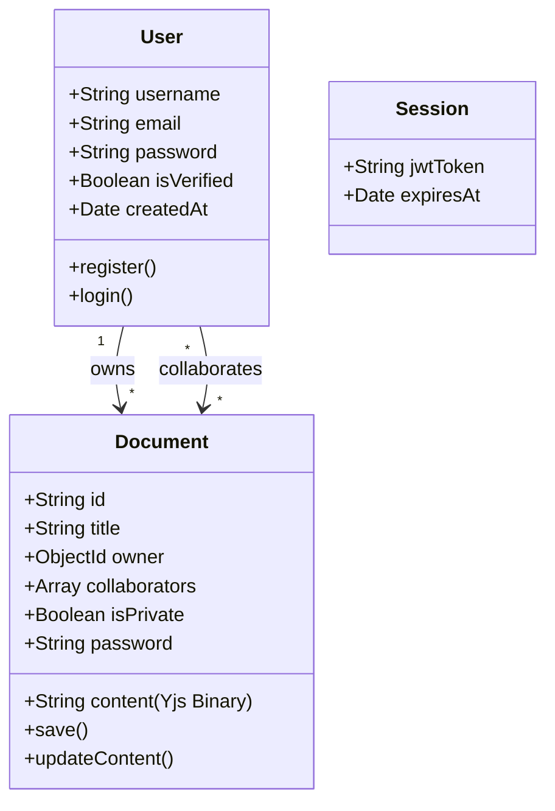
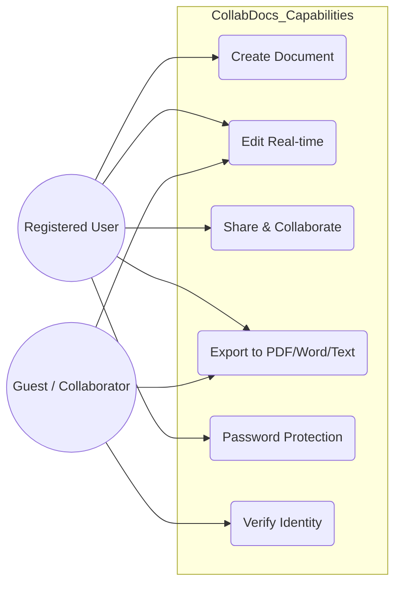
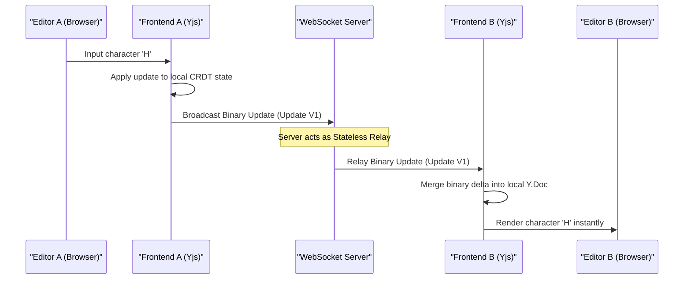

# CollabDocs Architecture Technical Documentation 🏗️

This document provide a deep-dive into the architectural patterns, data models, and synchronization flows and that power the CollabDocs real-time collaborative platform.

---

## 1. Class Diagram (Data Models)

The system is built on a robust, relational-meta model using **Mongoose (MongoDB)** for persistence and **Yjs/CRDTs** for operational data.

### Key Relationships:
- **Ownership**: Each document has a single primary `owner` who holds deletion privileges.
- **Collaboration**: Documents can be shared with multiple `collaborators` through unique IDs and secure password gates.

---

## 2. Use Case Diagram (System Interactions)

CollabDocs provides a tiered utility system where editors can manage, secure, and export their content seamlessly.

### User Roles:
- **Registered User**: Can create, own, and secure documents.
- **Collaborator**: Can edit and export shared documents upon identity verification (Password Gate).

---

## 3. Sequence Diagram (Real-Time Synchronization)

The heartbeat of CollabDocs is its **Conflict-free Replicated Data Type (CRDT)** synchronization engine, ensuring that no edits are lost, even under high-concurrency.

### Flow Mechanics:
1. **Optimistic UI**: User A sees their edit instantly (0ms latency feel).
2. **Binary Deltas**: Updates are sent as highly efficient binary blobs over WebSockets.
3. **Eventual Consistency**: Client B seamlessly merges the incoming delta, resolving any potential conflicts automatically through the CRDT algorithm.

---

## 🛡️ Security Architecture

CollabDocs utilizes a **stateless authentication** model:
- **JWT (JSON Web Tokens)**: Used for session-level security and document access verification.
- **Password Gates**: Documents can be further locked with custom passwords, requiring a separate verification token for decryption.
